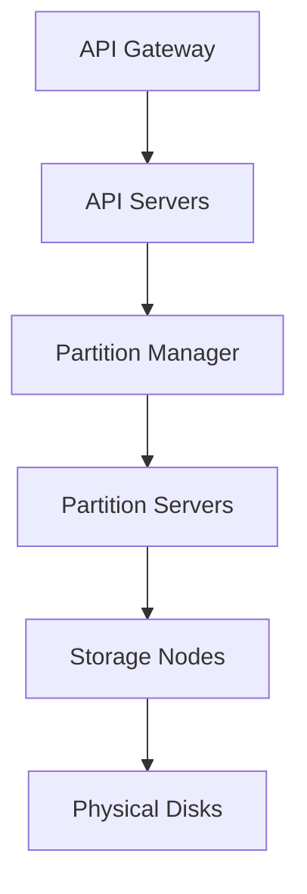
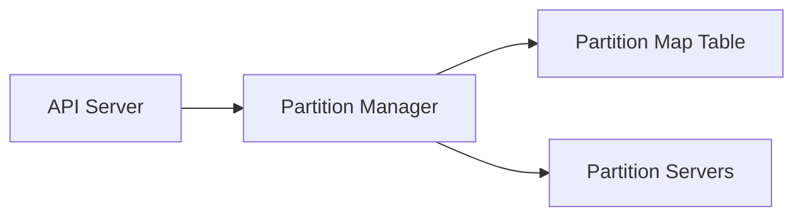

# 11. High Throughput Systems I — Learnings

---

## 🧩 Problem Context — Legacy Monolith with Master/Replica Databases

### Scenario
A large monolithic API server has:
- **1 Master DB** (for writes)
- **2 Replica DBs** (for reads)

### Problem
Thousands of legacy code paths are **hard-coded to use the master connection**, causing the master to become a bottleneck.

### Goal
Reduce read load on the master **without touching legacy code** (~100k+ LOC).

---

## 🧠 Solution — Dual Monolith Configuration via API Gateway

| Component | Purpose |
|------------|----------|
| **Monolith-1** | Legacy setup using master DB for default connection |
| **Monolith-2** | Identical setup but with default DB pointing to replica |

**API Gateway (KrakenD)** routing rules:
- `/me`, `/profile`, etc. → **Monolith-2 (read replica)**
- `/payments`, `/orders` → **Monolith-1 (master)**
- `*` (catch-all) → **Monolith-1**

➡️ **No code changes required** — only configuration duplication.

**Result:** Immediate reduction in master DB load and faster reads.

```mermaid
graph LR
A[Client] --> B[API Gateway (KrakenD)]
B --> |Read APIs| C[Monolith-2 (Replica)]
B --> |Write APIs| D[Monolith-1 (Master)]
C --> E[Replica DB]
D --> F[Master DB]
```

---

## ☁️ Designing an S3-Like Distributed File Storage

### Core Building Blocks
1. **API Layer** — Exposes CRUD APIs for files.
2. **Storage Layer** — Handles actual file I/O in append-only mode.
3. **Partitioning Layer** — Maps logical folders → physical storage nodes.
4. **Metadata Layer** — Tracks ownership, versions, and permissions.

---

## 🧱 Architecture Evolution

| Stage | Description |
|--------|--------------|
| **1. Monolithic** | Single API + local disk |
| **2. Multi-Disk** | Added multiple disks using hash(path) mod N |
| **3. Load Balanced** | Multiple API servers + sticky routing |
| **4. Decoupled Storage** | Separate API layer & networked storage layer |
| **5. Partition Manager Added** | Central coordination for data placement & failover |



---

## ⚙️ Key Design Concepts

### 1. Lock-Structured (Append-Only) Storage
- **Every write** → appended (no random seeks)
- Optimized for **cheap spinning disks**
- Enables **multi-version files** & **immutability**

### 2. Partitioning Strategy
| Aspect | Consistent Hashing | Range-Based Partitioning |
|---------|--------------------|---------------------------|
| Load Distribution | Random, even | Deterministic, predictable |
| Hot Partition Handling | Hard to detect/split | Easy to split (e.g., A–E → A–C, D–E) |
| Data Locality | Poor | Strong (same account/bucket grouped) |
| Throttling & Isolation | Hard | Easier per range |

➡️ **Range Partitioning chosen** — better control, easier scaling.

### 3. Partition Manager
- Central service managing all partitions.
- Stores mappings in a **Partition Map Table** (e.g., in Zookeeper/DynamoDB).
- Ensures **only one partition server** owns a range at a time.
- Handles **splits, merges, failovers**, and **leader elections**.



### 4. Storage Layer (Networked Disks)
- Each storage node = small disk + lightweight server.
- Writes always go to **head of the list** (symlinked).
- When 70% full → mark immutable → add a new head.
- Background **merge & compaction** frees space.

### 5. Durability
- Every write replicated **3 times**:
  1. Primary node
  2. Sync replica (same DC)
  3. Async replica (other region)
- Combines **RAID local redundancy** + **cross-region replication**.

### 6. Data Integrity
- End-to-end **checksums (CRC)** at every layer.
- **Detect & prevent** corrupted writes/reads.
- Optional **error-correcting codes** for recovery.

### 7. Metadata Database
- Stores file metadata:
  - Owner, permissions, timestamps, size, lifecycle
- Sharded by **bucket** for scalability.
- Serves list/info/permission APIs quickly.

### 8. Policy Management
- Rules applied at **bucket or path level**, not per file.
- Evaluated in order (like AWS S3 bucket policies).

---

## 🔒 Supporting Components

| Component | Responsibility |
|------------|----------------|
| **KrakenD** | API routing to monoliths |
| **Partition Manager** | Maintains range → server mapping |
| **Lock Service** | Guarantees exclusive ownership |
| **Zookeeper/DynamoDB** | Distributed coordination store |
| **Storage Manager** | Adds new storage node when full |
| **RAID/Replication** | Ensures durability |
| **Checksum Service** | Maintains data integrity |
| **Metadata DB** | Access control, lifecycle, ownership |

---

## 🧮 Durability + Consistency Summary

| Feature | Approach |
|----------|-----------|
| **Replication** | 1 sync + 1 async copy |
| **Disk Faults** | RAID 1/5/10 for intra-disk protection |
| **Region Failure** | Cross-region replication |
| **Integrity** | End-to-end checksums, CRC |
| **Versioning** | Append-only writes create immutable versions |

---

## 💡 Key Takeaways

1. **Config-based replication** buys time in legacy systems.  
2. **Sticky routing + replica reads** boost DB scalability.  
3. **Append-only writes** = high throughput + cheap disks.  
4. **Range partitioning** > consistent hashing for file systems.  
5. **Partition Manager + Lock Service** ensure strong coordination.  
6. **Separation of layers** (API, Partition, Storage) enables independent scaling.  
7. **Checksums + replication** = durability + integrity.  
8. **Metadata DB** accelerates non-file queries.  
9. **Policies via rule sets** simplify access control.  
10. **System design is iterative — defer crisis, don’t eliminate it.**
