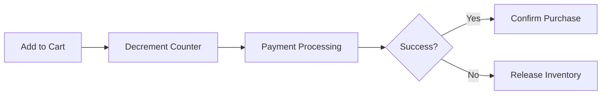
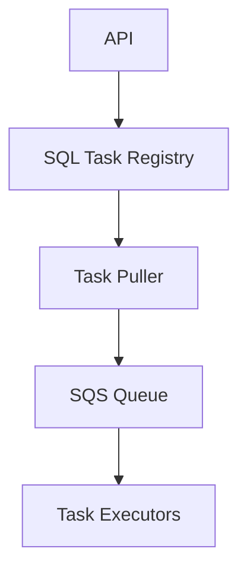

# Information Retrieval Systems II — Learnings Summary

---

## 1. Trigger Framework (Rule Engine Design)

### Objective

Design a trigger framework that automatically performs actions when specific conditions are met — for example, Swiggy's rider incentive system.

### Key Concepts

* **Generic pattern:** "When X happens → perform Y action"
* **Extensibility:** Ability to add/remove/modify rules dynamically.
* **Schema design:** Store event definitions and rules in normalized DB schema.
* **Rule Engine:** Match incoming events to stored rule conditions.

### Example

When a driver completes delivery, trigger: *compute incentive → add to account balance.*

---

## 2. Cricbuzz Live Commentary System

### Requirements

* Ordered by time.
* Heavy read traffic (1000x reads per write).
* Data immutable per ball.

### Database Choices

| Option                       | Pros                               | Cons            |
| ---------------------------- | ---------------------------------- | --------------- |
| **SQL (MySQL/Postgres)**     | Simple joins, ACID, mature tooling | Manual sharding |
| **NoSQL (MongoDB/DynamoDB)** | Auto-sharding, flexible schema     | Complex queries |

**Sharding key:** Match ID → risk of hotspot for popular matches.

### Architecture

```mermaid
graph TD
A[User] --> B[API Server]
B -->|addCommentary| C[Cache + DB]
B -->|getLatestCommentary| D[Cache (Redis)]
B -->|getCommentary| E[DB (Paginated)]
```

**Cache Layer:**

* Redis stores last few overs (e.g., 5 overs per match).
* Eviction policy for older data.
* Clustered Redis for replication.

### Communication Strategies

| Method        | Suitable? | Reason                                        |
| ------------- | --------- | --------------------------------------------- |
| WebSockets    | ❌         | Too many idle connections during slow updates |
| Long Polling  | ❌         | High connection wait, poor UX                 |
| Short Polling | ✅         | Simpler, tolerates few-second lag             |

---

## 3. YouTube View Count System (Distributed Counting)

### Problem Statement

Count billions of video views per day with eventual consistency and duplicate detection.

### Architecture

```mermaid
graph TD
A[Client] --> B[View Event API]
B --> C[Event Bus (Kafka/Kinesis)]
C --> D[Consumers (Batch Aggregators)]
D --> E[Persistent Store]
```

### Workflow

1. **ViewEventAPI:** accepts (videoId, userId, timestamp).
2. **EventBus:** partitions by videoId for aggregation.
3. **Consumers:** aggregate counts in-memory (5-min window), batch-write deltas.
4. **DB:** update with `count += X` per batch.

### Learnings

* **Batching + Partitioning** are critical for scalability.
* **Eventual consistency** is acceptable for large-scale counters.
* **Frameworks:** Apache Spark, Flink, Splunk, MapReduce.

---

## 4. Flash Sale System (Xiaomi / BookMyShow Style)

### Requirements

* Limited stock, millions of concurrent buyers.
* Guarantee atomic inventory updates.

### Flow



### Design Principles

* **Count decremented at Add-to-Cart:** reserve inventory early.
* **TTL Lock:** Reserve slot for 10 minutes, auto-release if unpaid.
* **On failure:** increment counter back.

### Implementation

| Aspect                | Choice                                            |
| --------------------- | ------------------------------------------------- |
| **Atomicity**         | Redis INCR/DECR or DynamoDB conditional updates   |
| **Persistence**       | Prefer DynamoDB/MySQL over pure Redis             |
| **Queue Alternative** | Use SQS as ticket queue — each message = one item |

### Alternate SQS Design

* Preload N messages (equal to inventory count).
* Each buyer pulls exactly one message atomically.
* Implements exactly-once semantics.

### Cleanup / Timeout Handling

* Redis TTL + background cron job (or Airflow DAG) to release locks.

---

## 5. Distributed Task Scheduler (Global Cron / Airflow / CloudWatch)

### Objective

Execute arbitrary tasks at scheduled times across distributed infrastructure.

### Components

| Component         | Responsibility                                   |
| ----------------- | ------------------------------------------------ |
| **Task Register** | Store all scheduled tasks (SQL table)            |
| **Task Puller**   | Query upcoming tasks (e.g., next 5 minutes)      |
| **Task Executor** | Execute task using workers (e.g., Lambda/Docker) |

### Architecture



### Scaling & Concurrency

Use query with skip locks:

```sql
SELECT * FROM tasks
WHERE scheduled_time <= NOW()
AND status = 'pending'
FOR UPDATE SKIP LOCKED;
```

* Prevents duplicate task execution.
* Each executor consumes independently.

### Handling Cron Syntax

* **Populator Service:** parses cron syntax → creates absolute timestamps for each day.
* Inserts computed timestamps into task table.

### SLA Monitoring

Track delay between enqueue and execution; scale executors dynamically.

---

## 6. Concurrency and DB Learnings

| Concept                 | Explanation                                                          |
| ----------------------- | -------------------------------------------------------------------- |
| **Exclusive Lock**      | Prevents both read and write — use with SKIP LOCKED for task queues. |
| **Shared Lock**         | Allows parallel reads; unsuitable for schedulers.                    |
| **SKIP LOCKED**         | Enables multiple workers to skip locked rows safely.                 |
| **Atomicity**           | Crucial for counters, locks, and task queues.                        |
| **Optimistic Locking**  | Best when conflicts are rare (version-based).                        |
| **Pessimistic Locking** | Needed for strict consistency (e.g., inventory).                     |

---

## 7. Key Takeaways

* **Focus on properties, not tools** — Atomicity, Isolation, Persistence, Eventual Consistency.
* **Batch, Cache, and Partition**: main scalability levers.
* **Event-driven architectures** are ideal for analytics, billing, counters.
* **Real-world analogies** simplify design: ticket counters, flash sales, seat booking.
* **Separate responsibilities**: registration, scheduling, execution — each as an independent service.

---

**End of Document** ✅
